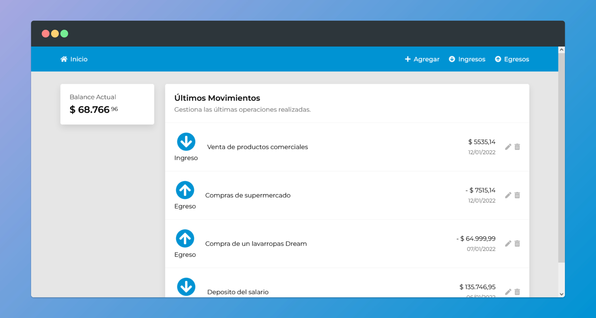
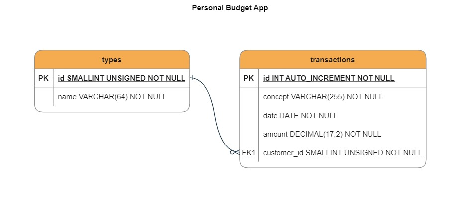

# Personal Budget App

## Table of Contents

- [Overview](#overview)
- [Usage](#usage)
  - [Prerequisites](#prerequisites)
  - [Setup](#setup)
- [Database](#database)
- [API Endpoints](#api)

## Overview <a id="overview"></a>



This is a project build for Alkemy following these [requirements](/docs/ChallengeFullstack-JavaScript.rev2.pdf) and was created with these technologies:
- **Frontend**: 
  - **Framework**: This project was bootstrapped with [Create React App](https://github.com/facebook/create-react-app).
  - **Styles**: For the styling it uses ***plain CSS*** within ***CSS modules***.
  - **Icons**: The icons are from [Font Awesome Icons](https://fontawesome.com/).

- **Backend**:
  - **Framework**: Is build in ***Node.js*** using the ***Express.js*** Framework.
  - **Database**: For the data uses the ***MySQL*** database. No ORM.

## Usage <a id="usage"></a>

### Prerequisites <a id="prerequisites"></a>

To make use of this project you need to have installed these programs in your system:

1. [MySql Community](https://dev.mysql.com/downloads/)
2. [Node.js](https://nodejs.org/en/)

### Setup <a id="setup"></a>

#### 1. Git clone this project in your machine.

```bash
git clone https://github.com/evarelaavalos/personal-budget-app
cd personal-budget-app
```
#### 2. Install the dependencies.

```bash
# In the root directory of the project
npm install
```

#### 3. Run the `initdb.sql` file in MySQL.

Located in the folder `./server/src/database/`.

#### 4. Create a `.env` file in the `/server` directory of your project.

Copy paste the following example into the file:

```bash
# .env file
#
# Add environment-specific variables on new lines in the form of NAME=VALUE
#
HOST=8000
MYSQL_HOST=localhost
MYSQL_USER=root
MYSQL_PASSWORD=s1mpl3
MYSQL_PORT=3306
```

The `HOST` variable is optional. By default its value is `8000`.

Set the variables with the data of your own database:

- `MYSQL_HOST`: The hostname of the database you are connecting to. (Default: `localhost`)
- `MYSQL_USER`: The MySQL user to authenticate as. (Default: `root`)
- `MYSQL_PASSWORD` (**required**): The password of that MySQL user.
- `MYSQL_PORT`: The port number to connect to. (Default: `3306`)

#### 5. Run the server.

```bash
# In the root directory of the project
npm run deploy
```

#### 6. Open the browser on the assigned port: `http://localhost:8000`

## Database <a id="database"></a>



## API Endpoints <a id="api"></a>

### `GET /transactions`

You can retrieve all the transactions made in the application.

### `POST /transactions`

To register a new transaction, send a POST request with a `body` like the next example:

```json
{
    "concept": "Compra de un lavarropas Dream",
    "date": "2020-12-02",
    "amount": 64999.99,
    "type": 1
}
```

### `PUT /transactions/{id}`

You can update an already existing transaction using the PUT request. It accepts a `body` similar to the POST request, except you cannot change the `type` field.

```json
{
    "concept": "Compra de un lavarropas con descuento",
    "date": "2020-12-02",
    "amount": 53200.99
}
```

### `DELETE /transactions/{id}`

You can delete a specific transaction.

### `GET /types`

You can retrieve all types of transactions available.

### `GET /balance`

Retrieves the current account balance of the application.
